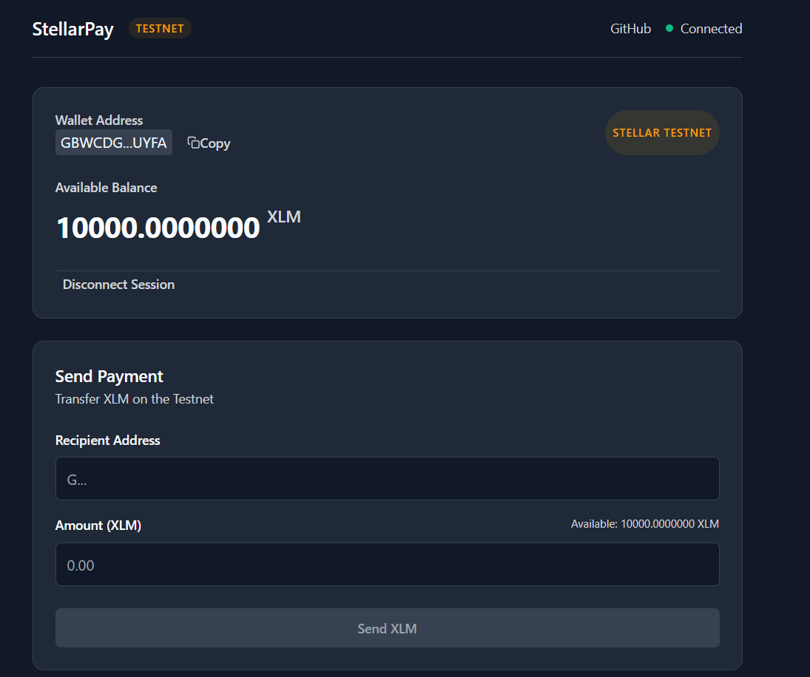
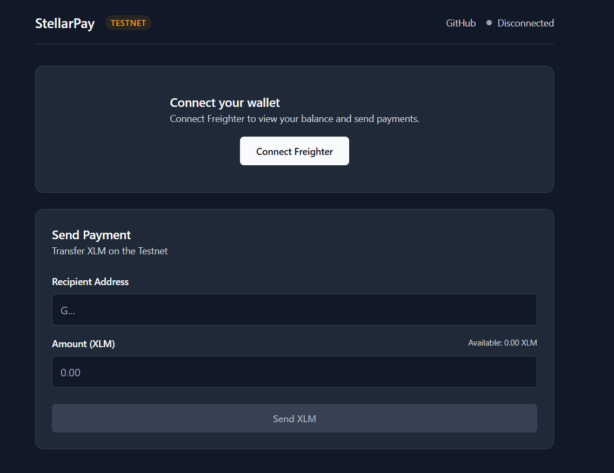
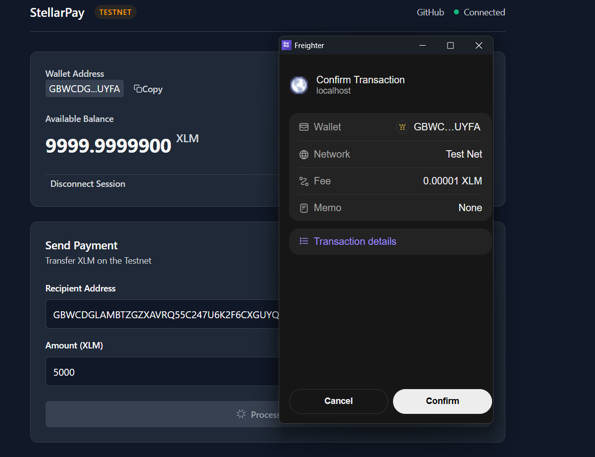
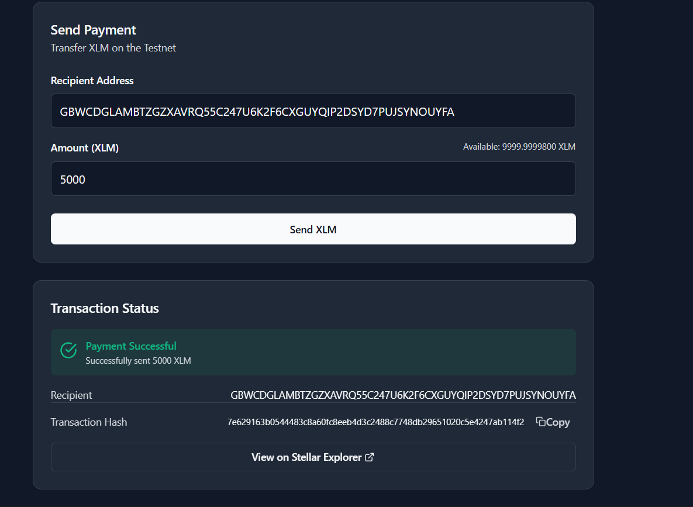

# StellarPay — Stellar Testnet Payment dApp

A minimal, production-quality Web3 payment interface built on the **Stellar Testnet**. StellarPay lets you connect your Freighter wallet, view your real XLM balance, and send payments to other Testnet accounts — all without touching real funds.

> ⚠️ **Testnet Disclaimer:** This application operates exclusively on the **Stellar Testnet**. All accounts and balances are fictitious test data. No real funds or Mainnet assets are involved at any point.

---

## Screenshots

| Wallet Connected | Disconnected State |
|:---:|:---:|
|  |  |

| Transaction Confirmation | Transaction Successful |
|:---:|:---:|
|  |  |

---

## Features

- 🔌 **Freighter Wallet Integration** — One-click connect via the Freighter browser extension
- 💰 **Real Testnet Balance** — Fetches and displays your live XLM balance from Stellar Testnet Horizon
- 📤 **Payment Sending** — Build, sign (via Freighter), and submit XLM payment transactions
- ✅ **Input Validation** — Address checksum validation via `StrKey`, amount/precision/balance checks
- 📋 **Copy to Clipboard** — Copy wallet address or transaction hash with one click and inline confirmation
- 🔍 **Explorer Links** — Direct link to stellar.expert for every successful transaction hash
- ⚠️ **Human-readable Errors** — Maps Horizon result codes (`op_no_destination`, `op_underfunded`, etc.) to friendly messages
- 🔄 **Auto Balance Refresh** — Balance updates automatically after each successful payment
- 🌙 **Dark/Light Mode** — Follows your OS preference via `prefers-color-scheme`
- 🔒 **Testnet-enforced** — Refuses to connect if Freighter is set to any non-Testnet network

---

## Tech Stack

| Layer | Technology |
|---|---|
| UI Framework | React 19 |
| Language | TypeScript 6 |
| Build Tool | Vite 8 |
| Wallet API | `@stellar/freighter-api` v6 |
| Stellar SDK | `@stellar/stellar-sdk` v17 |
| Styling | Vanilla CSS with CSS Custom Properties |
| Linting | oxlint |

---

## Prerequisites

Before running locally, make sure you have:

- **Node.js** v18+ (check with `node -v`)
- A **Chromium-based browser** (Chrome, Brave, Edge, Arc)
- The **[Freighter Wallet](https://www.freighter.app/)** browser extension installed and set to **Testnet**
- A funded Stellar **Testnet account** (see [Testnet Setup](#testnet-setup) below)

---

## Installation

```bash
# 1. Clone the repository
git clone https://github.com/pranavvv24/stellar-pay.git
cd stellar-pay

# 2. Install dependencies
npm install

# 3. (Optional) Copy env example — no secrets needed, all config is public Testnet URLs
cp .env.example .env
```

### Running Locally

```bash
npm run dev
```

The app will be available at **http://localhost:5173**

### Other Commands

```bash
npm run build    # Type-check and build for production (output → dist/)
npm run preview  # Preview the production build locally
npm run lint     # Run oxlint
```

---

## Testnet Setup

If you're new to Stellar Testnet, follow these steps:

### 1. Install Freighter

Download and install the [Freighter browser extension](https://www.freighter.app/).

### 2. Create or Import a Wallet

Open Freighter and create a new wallet. **Save your seed phrase securely offline** — StellarPay never asks for it.

### 3. Switch to Testnet

In Freighter:
1. Click the network indicator (top right, usually shows "Mainnet")
2. Select **Testnet**

### 4. Fund Your Account via Friendbot

Testnet accounts need at least **1 XLM** minimum balance to exist on-chain. Fund yours for free:

```
https://friendbot.stellar.org/?addr=YOUR_TESTNET_PUBLIC_KEY
```

Or use the [Stellar Laboratory Friendbot](https://laboratory.stellar.org/#account-creator?network=test) UI.

Your account will receive **10,000 XLM** of Testnet funds instantly.

---

## Usage Walkthrough

1. **Open the app** at `http://localhost:5173` (or the deployed URL)
2. **Connect your wallet** — click "Connect Freighter" in the Wallet card. Approve the connection in the Freighter popup.
3. **View your balance** — Your live Testnet XLM balance is fetched and displayed automatically.
4. **Enter payment details**:
   - **Recipient Address** — a valid Stellar public key starting with `G`
   - **Amount** — XLM amount (up to 7 decimal places, must not exceed your spendable balance)
5. **Click "Send XLM"** — StellarPay builds the transaction and prompts Freighter to sign it.
6. **Approve in Freighter** — Review and approve the transaction in the Freighter popup.
7. **View the result** — The transaction status card shows success (with a real hash) or a clear error message.
8. **Verify on chain** — Click "View on Stellar Explorer" to open the transaction on stellar.expert.

---

## Project Structure

```
stellar-pay/
├── src/
│   ├── components/
│   │   ├── CopyButton.tsx        # Reusable copy-to-clipboard button
│   │   ├── Header.tsx            # App header with network status
│   │   ├── PaymentForm.tsx       # Recipient/amount form with validation
│   │   ├── TransactionStatus.tsx # Status card (idle/signing/processing/success/error)
│   │   └── WalletCard.tsx        # Wallet connect/balance display
│   ├── hooks/
│   │   ├── useBalance.ts         # Fetches XLM balance from Horizon
│   │   ├── useTransaction.ts     # Builds, signs, and submits transactions
│   │   └── useWallet.ts          # Manages Freighter connection state
│   ├── lib/
│   │   ├── freighter.ts          # Freighter API wrappers
│   │   ├── stellar.ts            # Horizon server + Testnet config
│   │   └── validation.ts         # Address and amount validators
│   ├── App.tsx                   # Root component, wires hooks together
│   └── index.css                 # Design system (CSS custom properties)
├── .env.example                  # Public config template (no secrets)
├── .gitignore
└── package.json
```

---

## Deployment

> **Live URL:** _Add your deployed URL here once live (e.g. Vercel, Netlify, Cloudflare Pages)_

### Deploying to Vercel (recommended)

```bash
npm run build
# Then connect your GitHub repo to Vercel — it auto-detects Vite projects.
# No environment variables needed — all config is hardcoded Testnet URLs.
```

### Deploying to Netlify

```bash
npm run build
# Build command:  npm run build
# Publish dir:   dist
```

---

## GitHub Repository

[https://github.com/pranavvv24/stellar-pay](https://github.com/pranavvv24/stellar-pay)

---

## License

MIT

---

> ⚠️ **Testnet Only — No Real Funds:** StellarPay is configured exclusively for the Stellar Testnet. The network passphrase, Horizon endpoint, and Freighter network check all enforce Testnet-only operation. There is no Mainnet configuration. Do not send real XLM to addresses shown in this app.
